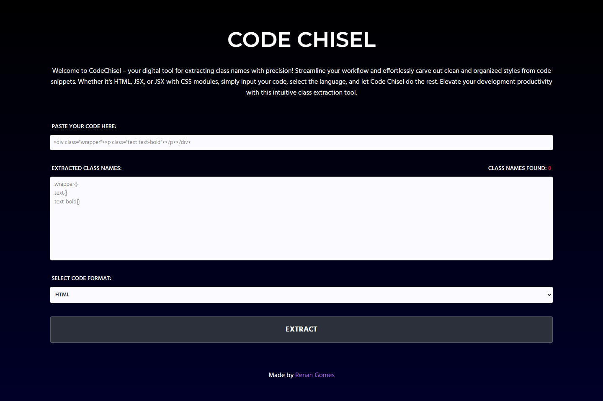

# CodeChisel

## Overview

CodeChisel is a lightweight tool designed to streamline the process of extracting class names from HTML, JSX, or JSX with CSS modules. The inspiration behind this project stems from the common developer struggle of manually copying and pasting class names from code snippets into a separate CSS file. CodeChisel simplifies this workflow, enhancing your development productivity by automating the extraction and organization of class names.

## Why CodeChisel?

As a developer, I frequently found myself spending unnecessary time copying class names from HTML or JSX files and pasting them into CSS files. This manual process not only drained my time but also introduced the potential for errors. CodeChisel was developed to address this pain point, providing a hassle-free solution for extracting and managing class names effortlessly.

## Features

- **Code Format Support:** Extract classnames from HTML, JSX, or JSX with CSS modules.
- **Module Import:** Specify the module import name when dealing with JSX and CSS modules.
- **Efficiency Boost:** Streamline your workflow by automating the extraction process.
- **User-Friendly Interface:** Simple and intuitive, making it easy for developers to integrate into their workflow.

## How to Use

1. **Input Code:** Paste your HTML, JSX, or JSX with CSS modules code into the input.
2. **Select Code Format:** Choose the appropriate code format from the dropdown menu (HTML, JSX, JSX with Modules).
3. **Specify Module Import (if applicable):** If working with JSX and CSS modules, enter the module import name in the designated input field.
4. **Click "Extract Classnames":** Let CodeChisel do the work! Extracted classnames will be displayed in the output textarea.

## Getting Started

To use CodeChisel, simply visit the [CodeChisel Website](https://code-chisel.vercel.app/) and start boosting your development productivity today!

## Contributing

If you'd like to contribute to CodeChisel, please follow our [contribution guidelines](CONTRIBUTING.md).

## Issues and Feedback

For bug reports, feature requests, or general feedback, please [open an issue](https://github.com/RGomes98/codechisel/issues).

## License

This project is licensed under the [MIT License](LICENSE.md).
